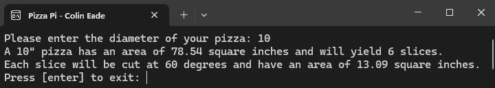
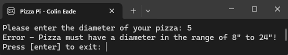

# Assignment 1 - PizzaPi
**Date:** October 5, 2022

The "Pizza Pi" application is a simple Python program designed to introduce and apply fundamental programming concepts 
through a practical example. When prompted, users input the diameter of a pizza, and the app calculates the pizza's 
area, the number of slices it can be divided into, the area of each slice, and the angle at which each slice is cut. 
This project serves as an example of basic syntax, control structures, mathematical operations, and user input handling 
in Python.
# Features
* **User Input for Pizza Diameter:**  Accepts the diameter of the pizza in inches.

* **Calculation of Pizza Area:** Utilizes the mathematical formula for the area of a circle to calculate the pizza's area.

* **Determination of Slice Count:** Based on the pizza diameter, the program decides on an appropriate number of slices.

* **Calculation of Slice Area and Angle:**  Further applies mathematical concepts to determine the area of each slice 
and the angle at which each slice is cut.

* **Error Handling:** Includes basic error handling for non-numeric input and input that falls outside a predefined range.
# Example Images

