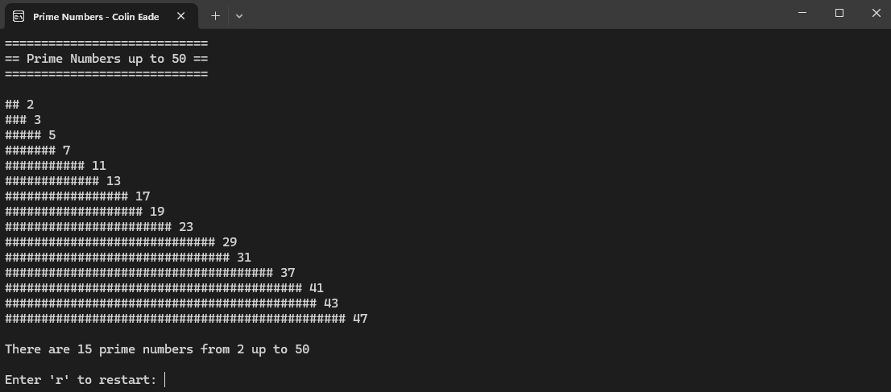
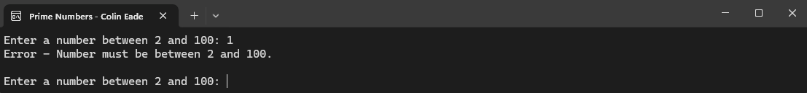
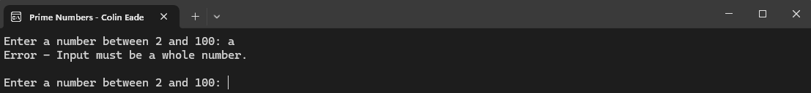

# Assignment 2 - PrimeNumbers
**Date:** October 29, 2022

The "Prime Numbers" application is a Python-based terminal program designed to show fundamental programming principles 
through a focused mathematical concept. Users are prompted to enter a numeric limit, and the app dynamically identifies 
and graphically represents all prime numbers up to that specified limit. This project highlights basic to intermediate 
programming concepts such as loops, conditionals, user input validation, and mathematical computations, demonstrating 
the practical application of Python in solving problems.
# Features
* **User Input for Number Range:** Allows users to specify the upper limit for the range within which prime numbers are 
to be identified.

* **Visual Representation of Prime Numbers:** Each prime number is represented visually by a line of hashes (#), with 
the length of each line corresponding to the prime number's magnitude.

* **Dynamic Range Handling:** Users can specify any range between 2 and 100.

* **Prime Number Identification:** Utilizes an algorithm to determine whether numbers within the specified range are prime.

* **Repeat Functionality:** Offers users the option to restart the application with a new range without needing to 
rerun the program.

* **Error Handling:** Incorporates error checking for non-numeric inputs and inputs outside the permissible range.
# Example Images

