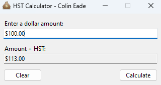
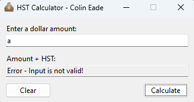

# Assignment 3 - HstCalculator
**Date:** November 21, 2022

The "HST Calculator" is a Python GUI application designed to show the fundamental concepts of GUI programming and 
event-driven programming. This application allows users to input a pre-tax dollar amount, calculates the HST at a rate 
of 13%, and displays the total amount including tax. It serves as a functional demonstration of applying Python and the 
Tkinter library to create interactive and user-friendly desktop applications. The project emphasizes the application of 
constants, function definitions, and GUI widget handling, providing a hands-on experience with Python's versatility 
in developing applications with real-world utility.
# Features
* **Interactive User Input Field:** Provides a text entry field where users can input the base dollar amount.

* **HST Calculation and Display:** Automatically calculates and displays the total cost including a 13% HST.

* **GUI Appearance:** Utilizes the Tkinter ttk module for styling.

* **Clear Functionality:** Includes a "Clear" button to reset the input and output fields to their default states.

* **Keyboard Shortcut Integration:** Enhances user experience by supporting keyboard shortcuts for operations like 
calculation and clearing input.

* **Error Handling for Invalid Input:** Implements error checking for non-numeric and negative inputs, displaying 
error messages in the GUI.
# Example Images

