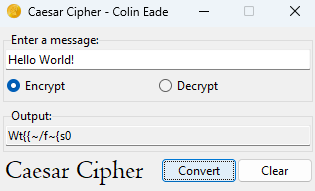
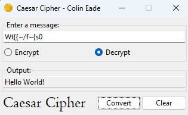
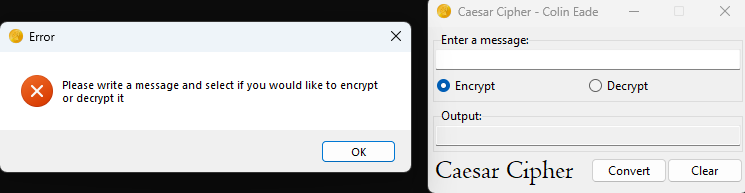

# Assignment 4 - CaesarCipher
**Date:** November 29, 2022

The "Caesar Cipher" application leverages Python and the Tkinter library to create a GUI app that encrypts and decrypts 
messages using the Caesar Cipher method. This app demonstrates intermediate programming concepts, including GUI design, 
event-driven programming, and the practical implementation of classic encryption techniques. Users can interact with 
the application to securely encrypt a message or decrypt a provided cipher text, providing a hands-on experience with 
both cryptography fundamentals and Python programming.
# Features
* **Interactive Text Fields:** Offers two text fields for users to input their messages and see the encrypted or decrypted 
results.

* **Encrypt and Decrypt Options:** Includes radio buttons for users to select whether they want to encrypt or decrypt 
a message.

* **One-Click Conversion:** Features a "Convert" button that, when clicked, processes the input based on the selected operation (encrypt or decrypt).

* **Clear Functionality:** Provides a "Clear" button that resets the application to its initial state.

* **Keyboard Shortcuts:** Integrates keyboard shortcuts (Enter to convert and Escape to clear).

* **Error Handling:** Incorporates error checking to ensure users have entered a message and made a selection before 
attempting a conversion.
# Example Images

