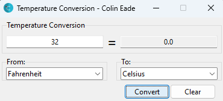
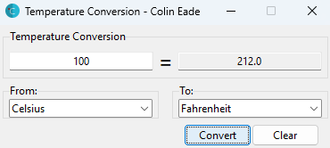
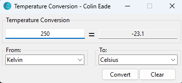
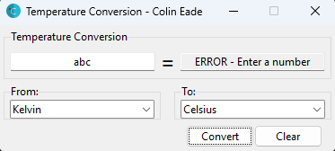

# Assignment 5 - TemperatureConversion
**Date:** December 10, 2022

The "Temperature Conversion" application is a Python GUI tool designed for converting temperatures between Celsius, 
Fahrenheit, and Kelvin. It demonstrates the implementation of GUI components using Tkinter, user interaction through 
input fields and buttons, and the application of temperature conversion formulas. This project highlights how to 
interact with users through a graphical interface and perform calculations based on user input, showcasing the 
practical use of Python in creating utilities for everyday tasks.
# Features
* **Flexible Temperature Input:** Allows users to enter a temperature in any of the three major temperature scales 
(Celsius, Fahrenheit, Kelvin).

* **Temperature Conversions:** Converts the input temperature to the temperature of their choice.

* **Intuitive User Interface:** Features a straightforward and user-friendly GUI.

* **Clear Functionality:** Offers a "Clear" button to quickly reset all fields to default values.

* **Combobox Selection for Units:** Incorporates comboboxes for selecting both the input and output temperature units.

* **Keyboard Shortcuts Integration:** Responds to keyboard events, such as the Enter key for conversions and the 
Escape key for clearing inputs.

* **Error Handling for Invalid Inputs:** Ensures that only numeric input is accepted, displaying an error message 
for invalid entries.
# Example Images

